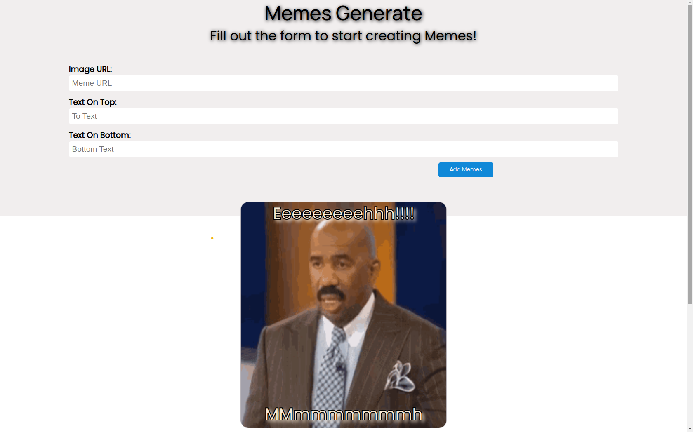

# Meme Generator
For this assignment, you’ll be building a meme generator in the browser using HTML, CSS, and JavaScript.

Your generator should consist of a form that accepts a link to an image, text for the top of the meme, and text for the bottom of the meme. When the user submits the form, use JavaScript to append to the DOM a div which contains the meme, including the image and its text.

### Requirements

- User should be able to submit a form on the page to generate a new meme on the page, and should be able to add multiple memes to the page by submitting the form multiple times.
- Users should be able to click on a button to remove a meme from the page.
- When the meme form is submitted, values in the form inputs should be cleared.
- Be sure to style your meme generator! It should be functional but also look nice.

#### Only use vanilla JavaScript only: no frameworks/third-party libraries.

### Go Live
[Live Link](https://mem-gen.netlify.app/) 

## My process

### Display

### Built with

- Semantic HTML5 markup
- CSS custom properties
- Flexbox
- CSS Grid
- Positioning

## Author

- [@Have-Samuel](https://www.frontendmentor.io/profile/Have-Samuel)
- [@samhave1](https://twitter.com/samhave1)
- [LinkedIn](https://www.linkedin.com/in/have-samuel/)

## 📝 License

This project is [MIT](./MIT.md) licensed.